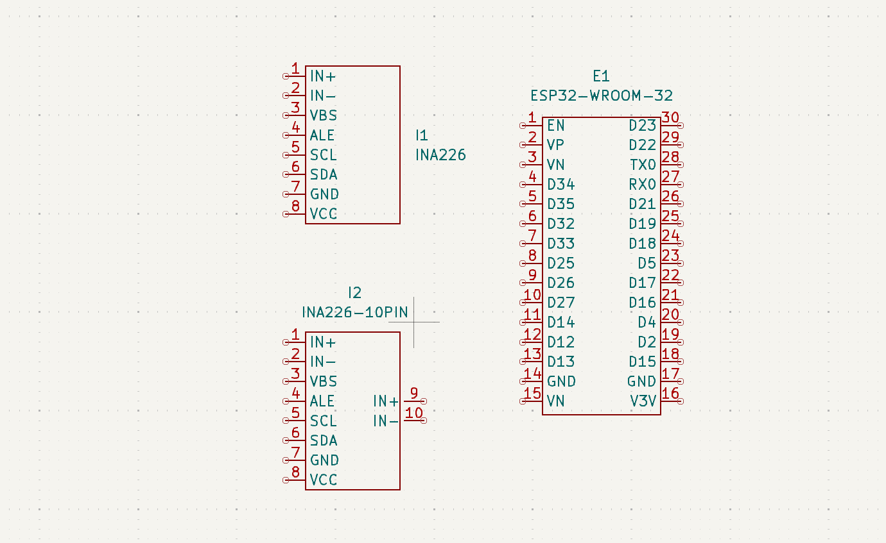
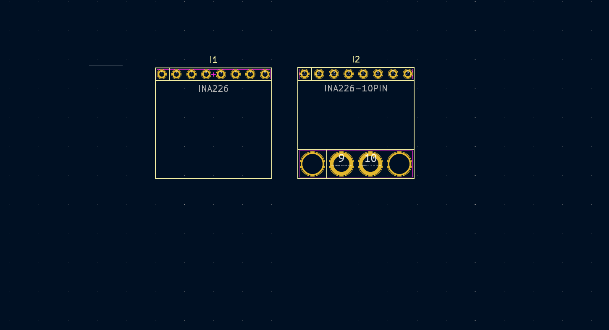

# KiCadLibraries


)


This repository contains symbol and footprint libraries for use in KiCad. It is intended for IoT and electronics projects.




## Installation
1. Clone the repository:
    ```bash
    git clone https://github.com/realsba/KiCadLibraries.git
    ```
2. Open KiCad and add the libraries:
    - Open "Preferences" -> "Manage Symbol Libraries" for symbols.
    - Open "Preferences" -> "Manage Footprint Libraries" for footprints.
    - Add the corresponding files from the repository.

## Usage
- Select the necessary symbol or footprint when creating a schematic or PCB in KiCad.
- Use KiCad's built-in functions to work with the libraries.

## Project Structure
- 
- 

## Technologies Used
- **KiCad**: Software for creating electronic schematics and PCBs.
- **GitHub**: Platform for hosting the repository and version control.

## Contributing
Contributions are welcome! Feel free to open an issue or submit a pull request.

## License
This project is licensed under the MIT License - see the [LICENSE](https://github.com/realsba/KiCadLibraries/blob/main/LICENSE) file for details.

## Author
- Bohdan Sadovyak

## Bugs/Issues
Please report any bugs or issues [here](https://github.com/realsba/KiCadLibraries/issues).